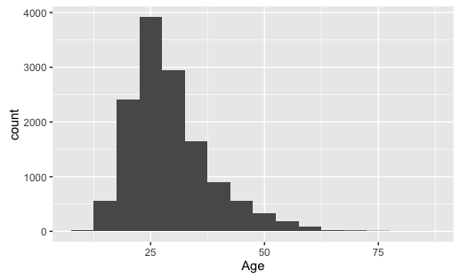

# Cleaning and Combine Free Code Camp Survey Data

## Table of Contents

<!-- START doctoc generated TOC please keep comment here to allow auto update -->
<!-- DON'T EDIT THIS SECTION, INSTEAD RE-RUN doctoc TO UPDATE -->


- [Introduction](#introduction)
- [Prerequisites to Rerun Data Manipulations](#prerequisites-to-rerun-data-manipulations)
- [Reproduce Cleaning and Combining of Data](#reproduce-cleaning-and-combining-of-data)
- [Notable Data Transformations](#notable-data-transformations)
  - [Obvious Outliers](#obvious-outliers)
  - [Numeric Ranges](#numeric-ranges)
  - [Years to Months](#years-to-months)
  - [Normalization of Answers](#normalization-of-answers)
- [Getting Started Analyzing Data with R](#getting-started-analyzing-data-with-r)
  - [Loading Data](#loading-data)
  - [Example: Age](#example-age)
- [Changelog](#changelog)

<!-- END doctoc generated TOC please keep comment here to allow auto update -->

## Introduction

The survey data was broken up into two parts and need to be combined into one
for ease of future downstream analyses. Additionally, these two data sets need
to be cleaned up a bit because of the nature of survey data.

## Prerequisites to Rerun Data Manipulations

- [R][RProj] (>= 3.3.0)
- [dplyr][dplyrGH] (>= 0.5.0) [CRAN][dplyrCRAN]
- [Rcpp][RcppGH] (>= 0.12.6) [CRAN][RcppCRAN]

[RProj]: https://www.r-project.org/
[dplyrGH]: https://github.com/hadley/dplyr
[RcppGH]: https://github.com/RcppCore/Rcpp
[dplyrCRAN]: https://cran.r-project.org/web/packages/dplyr/index.html
[RcppCRAN]: https://cran.r-project.org/web/packages/Rcpp/index.html


## Reproduce Cleaning and Combining of Data

Running the following script will create a new file
`2016-FCC-New-Coders-Survey-Data.csv` file in this directory `clean-data/`.

```shell
git clone https://github.com/FreeCodeCamp/2016-new-coder-survey.git
cd clean-data
Rscript clean-data.R
```


## Notable Data Transformations

### Obvious Outliers

In some of the numeric free text answers, numeric values were filtered out if it
was beyond a reasonable threshold. For example, an answer saying you've coded
for 100,000 months would be removed.

### Numeric Ranges

Some answers were given as ranges. For example, a range of "9-10" months of
programming might have been answer to a question. The average of this range was
taken when possible.

### Years to Months

Some answers to a question asking about months were given in years. These were
converted to months if possible.

### Normalization of Answers

Some of the free text answers were very similar to each other, with the
exception of a space or two. These will register as different answers if you
aren't looking for them. Answers like "Cybersecurity" and "Cyber Security" are
the same and were changed to a consistent manner. There may have been some
missed.


## Getting Started Analyzing Data with R

### Loading Data

For an initial look at the data, you can load the data into R with the
following commands.

```r
> library(dplyr)  # Used for each of use and manipulation of data
> setwd("directory-where-clean-survey-data-is")  # Change this to your path
> survey <- read.csv(file = "2016-FCC-New-Coders-Survey-Data.csv",
+                   header = TRUE,
+                   na.strings = NA,
+                   stringsAsFactors = FALSE) %>% tbl_df()
```


### Example: Age

```r
> survey %>% select(Age) %>% filter(!is.na(Age)) %>% summary()
#       Age
#  Min.   :10.00
#  1st Qu.:23.00
#  Median :27.00
#  Mean   :29.18
#  3rd Qu.:33.00
#  Max.   :86.00
> library(ggplot2)  # Use for data visualizations
> survey %>% filter(!is.na(Age)) %>%
+ ggplot(aes(x = Age)) + geom_histogram(binwidth = 5)
```




## Changelog

- 2016 Aug 1st
    - Set minimum commute time to 300 minutes
    - Set minimum home mortgage to $1000 and maximum home mortgage to $1000000
    - Set minimum student debt to $1000 and maximum student debt to $500000
    - Check for consistent answers for number of children and yes/no to having
      childen i.e. if you answered yes to having children, you should have a
      number for number of children
    - Fix spelling mistake in `IsReceiveDisabilitiesBenefits` (original:
      IsReceiveDiabilitiesBenefits)
    - Update R and R package versions
- 2016 May 18th
    - Initial dataset combine and cleaning
